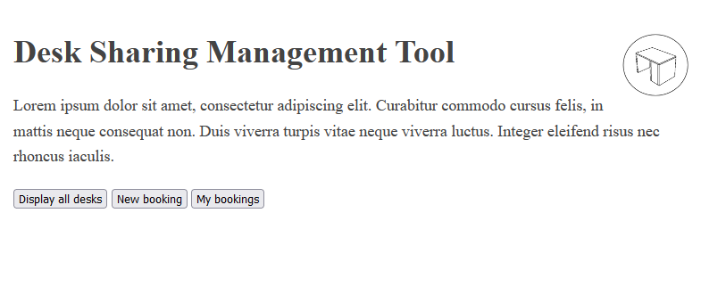
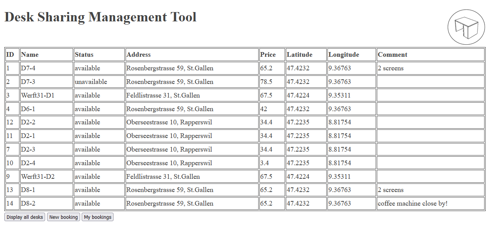
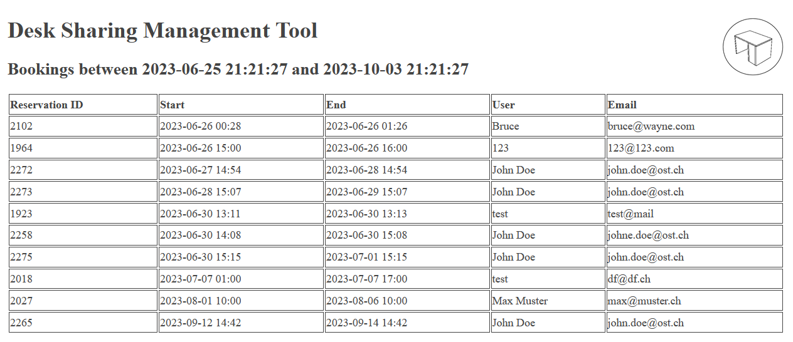
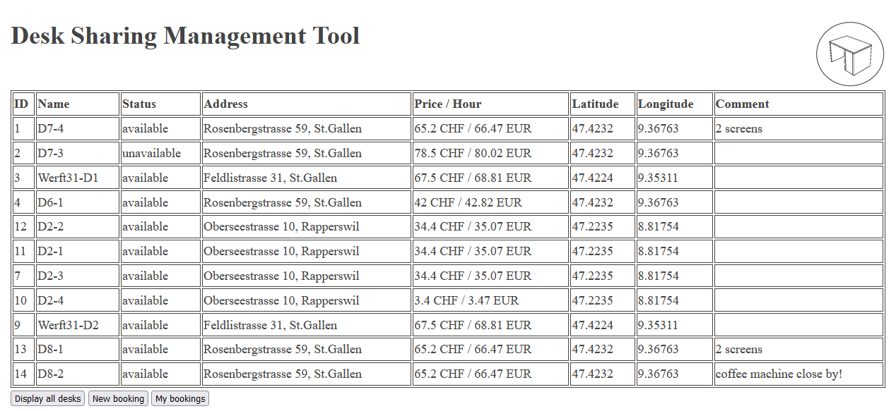
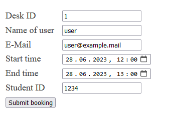
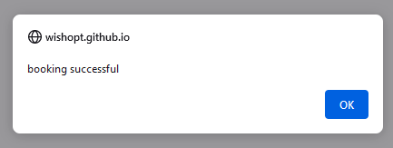
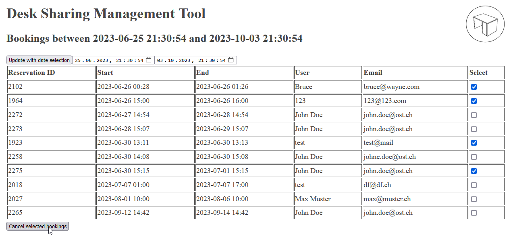

# Project Documentation - Desk Sharing Management

## WBDG: Web Development Fundamentals (FS 2023)

Created by: Noah Weishaupt, BB20 WINF

## Task 1: Basic Structure

### Basic Program Architecture

As described in the task description, I've created a basic file structure consisting of the `index.html` file, a subdirectory for images, and a placeholder `scripts.js` and `style.css` file. I also created a `docs` folder containing my notes for each task.

The basic layout of the `index.html` file was generated using a command in [Visual Studio Code](https://code.visualstudio.com/). After generating the basic structure, I added links to the `style.css` and `scripts.js` files. I also created a simple logo with a [public domain clipart](https://openclipart.org/detail/294701/desk-rotated-plain-perspective).

*Image 1: First version of the website*

I already made a small mistake at this step: When embedding the `scripts.js` file into `index.html`, I added the script tag into the header of the file. This was later a problem, as the `scripts.js` file was loaded before the DOM-Elements were created, because of which I wasn't able to add eventlisteners to the buttons.

The finished file structure can be found in [this commit](https://github.com/wishopt/WBDG-2023/commit/4a25ac25757a9a4feaf100f201dc52f407682353) on Github.

### Design Sketches

As designing user interfaces is not my strong point, I tried to keep the interface as simple and practical as possible. The tool consists of a header containing the page title and a main body consisting of a table containing all the relevant data about the available desks. Located below the table are the buttons, with which the user can interact with the tool by creating and cancelling bookings.

*Image 2: Sketch of the desktop version*

The mobile version is the same as the desktop version, with the only difference being that linebreaks are added to the text within the cell if the window gets smaller. Originally I inteded for the table to collapse if the window got too small, but since the table already looked good enough on my phone (after zooming out a bit) that I didn't think that it was worth the effort of implementing it.

*Image 3: Sketch of the mobile version*

## Task 2: Dynamic Elements

### Retrieving the Data

Retrieving the data was quite simple. I create a variable called `baseURL` which contained the URL to the server from which we're supposed to exchange data with. When making the specific API-calls, I appended the corresponding endpoint before sending the request (`baseURL + "/desks"` for receiving the desk data, as an example). This way, if I were to take the course again next year, I could just change the `baseURL` variable to `"https://matthiasbaldauf.com/wbdg24"` without having to change the URL in every function where I make an API-call.

I used the [Fetch API](https://developer.mozilla.org/en-US/docs/Web/API/Fetch_API/Using_Fetch) for the requests to the server. In this first step, I just stored the response in a variable and converted it into JSON. This way, I could directly use the data without further transformation.

Using the data from the response, I dynamically generated an HTML table containing all the desk data, as described in the design sketch. Here I came across another hurdle: In order to generate the table, I looped through the data by using a nested loop, in order to easily generate table row (`<tr>`) and table data (`<td>`) tags. The response consisted of an array containing objects describing one desk each. Because the outer loop was for an array, I had to use the `of` keyword instead of the `in` keyword, as described [here](https://developer.mozilla.org/en-US/docs/Web/JavaScript/Reference/Statements/for...of). Because the inner loop iterated through the properties of an object, I had to use the `in` keyword for the inner loop. This was slightly confusing at first.

In each cycle of the inner loop, I checked if the name of the property was `available`. If it was, I used a [ternary operator](https://developer.mozilla.org/en-US/docs/Web/JavaScript/Reference/Operators/Conditional_operator) to change the text content of the cell to either "available" or "unavailable".

*Image 4: Dynamically generated table containing the desk data*

The relevant commit can be found [here](https://github.com/wishopt/WBDG-2023/commit/f7c216c272c3332fa7bf33af126d5cad3b8c4931). At this point, I forgot to add the ability to view the bookings of a table. I added this feature at a later point in [this commit](https://github.com/wishopt/WBDG-2023/commit/d147ec3a5f1be21f1241c446c874e653071651d4).

## The Problem with the API

When I went back and added the functionality to list all the current bookings of a desk, I came across the biggest problem I had while working on this project. At first I thought I made a mistake, because I was able to get a list of the booking for a desk, but I when trying to create a booking, I always received the response that the desk was already booked at that time.

At first I thought that there was something wrong with the dates that I supplied, but after about two hours of trying all kinds of different things, I noticed the problem: The API only gives you the bookings that were created with the student ID that you had to send with the request. Because of this, you are not able to give the user a complete list of all the bookings of a table. 

I think that the API could be improved by making the student ID parameter optional. If it isn't supplied, the user should get a list of all the bookings from every user, because otherwise he just has to try different timeslots until he finds one that is open.

*Image 5: Bookings for desk 1 of student 1234*

### Implementing Costs per Hour in Different Currencies

The implementation of the currency conversion worked pretty much the same way as retrieving the desk data. I created a global variable called `conversionRates` where I stored the current rates that I received from the [exchangerate.host API](https://exchangerate.host/#/#docs). Afterwards, I checked each time when generating a cell in the table if the property name was `price`, and changed the contents accordingly.

The only problem was that I didn't know right away how to quickly round a number to two decimals in JavaScript, but this was fixed with a [quick trip to stackoverflow](https://stackoverflow.com/questions/11832914/how-to-round-to-at-most-2-decimal-places-if-necessary).

*Image 6: Updated table containing price in different currencies*

The relevant commit can be found [here](https://github.com/wishopt/WBDG-2023/tree/8daeef3c9e607eb85caef1cff10cfbe518c6dc17).

## Task 3: Send Data

### Validating the Inputs

Creating a booking wasn't a problem either for the most part. In order to validate the inputs, I created a function for each field, which would return either `true` or `false`, depending on if the input was correct. I then chained all those functions together in an if statement that would only go through if all functions returned `true`.

For the validation of the "name" field, I only checked if there was any input at all. You never know when someone with a very special name shows up that uses characters you didn't account for.

For the "email" and "student ID" fields I used [regular expressions](https://developer.mozilla.org/en-US/docs/Web/JavaScript/Guide/Regular_expressions) for input validations. I didn't bother trying to learn the regEx syntax, and just copy-pasted a pattern from somewhere else. I checked if those patterns were correct with [this regEx tester](https://regexr.com/).

*Image 7: Input fields*

The commit containing input validation can be found [here](https://github.com/wishopt/WBDG-2023/commit/79b1f877fd3a1b64cdddb5efa2da4fc991ac3c4a).

### Sending the Booking Request

I had a little bit of trouble when sending the booking request. At first I used [URLSearchParams](https://developer.mozilla.org/en-US/docs/Web/API/URLSearchParams), as I've only used GET requests before. After some troubleshooting and a hint from a classmate I learned that the POST request requires a request body containing [FormData](https://developer.mozilla.org/en-US/docs/Web/API/FormData) instead of JSON. I later noticed that this is also mentioned on the [MDN docs page for POST requests](https://developer.mozilla.org/en-US/docs/Web/HTTP/Methods/POST).

*Image 8: Successful booking*

My first unsuccessful try of sending data can be found in [this](https://github.com/wishopt/WBDG-2023/commit/79b1f877fd3a1b64cdddb5efa2da4fc991ac3c4a) commit. I later fixed it [here](https://github.com/wishopt/WBDG-2023/commit/dd0b82d57be8e02d9223b90434d2e64acec62b33).

### Saving the User Data Locally

Saving data was very simple with the [localStorage](https://developer.mozilla.org/en-US/docs/Web/API/Window/localStorage) API. The only thing you have to watch out for is that the function `localStorage.getItem()` return `null` if there isn't any data available. Therefore, you have to do a quick check after loading the value, and set a default value if it was set to `null`.

The commit containing the save feature can be found [here](https://github.com/wishopt/WBDG-2023/commit/1ee52c5dfeff15e28da0c8f06f2c36402f64d523).

### Cancelling Bookings

In order to allow the user to cancel bookings, I added an additional column to the desk bookings view, which contains a checkbox. The user can check multiple bookings at once, and delete them all by clicking "Cancel selected bookings".

I achieved this by giving each checkbox an ID corresponding to the position of the booking in the response array. When clicking on the "Cancel selected bookings" button, I loop through the variable containing the booking data once again, and check for each booking if the corresponding checkbox is checked. If it's checked, I add the booking to an array called `deletions`. Afterwards, I loop through the `deletions` array and send a DELETE request for each booking marked for deletion.

*Image 9: Cancelling bookings*

The commit for cancelling bookings can be found [here](https://github.com/wishopt/WBDG-2023/commit/b3c3eb0acb5ea22c602733f1300dc2a536b4482f).

## Conclusion

While working on this project, I learned a lot about working with APIs. Up until now, I've only created websites locally without a lot of API calls from the internet besides some simple GET requests. Working with APIs allows you to create many new and unique services that wouldn't be possible otherwise.

The final result can be found online at [https://wishopt.github.io/WBDG-2023/](https://wishopt.github.io/WBDG-2023/), or you can download the files and open them locally.

This documentation was written while working on the project using MarkDown. The PDF was generated from the MarkDown file using the [Markdown PDF](https://github.com/yzane/vscode-markdown-pdf) plugin for VS Code.