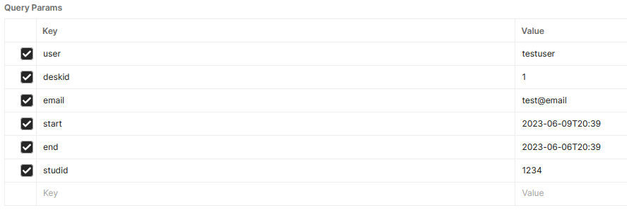
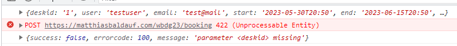

# Task 3

## Form validation

- changed design: desks are now always displayed
- validated inputs with the RegExp object
    - for some reason it didn't work when checking if the student ID only contains numbers
    - directly entering the regular expression and testing that (`/^\d+$/.test(id)`) worked, don't know hy

## Sending the booking request

- the POST request to `https://matthiasbaldauf.com/wbdg23/booking` doesn't seem to work
    - always responds with `"parameter <deskid> missing"`, both inside of the tool, and when testing the API with [Postman](https://web.postman.co/)
    - 
    - 